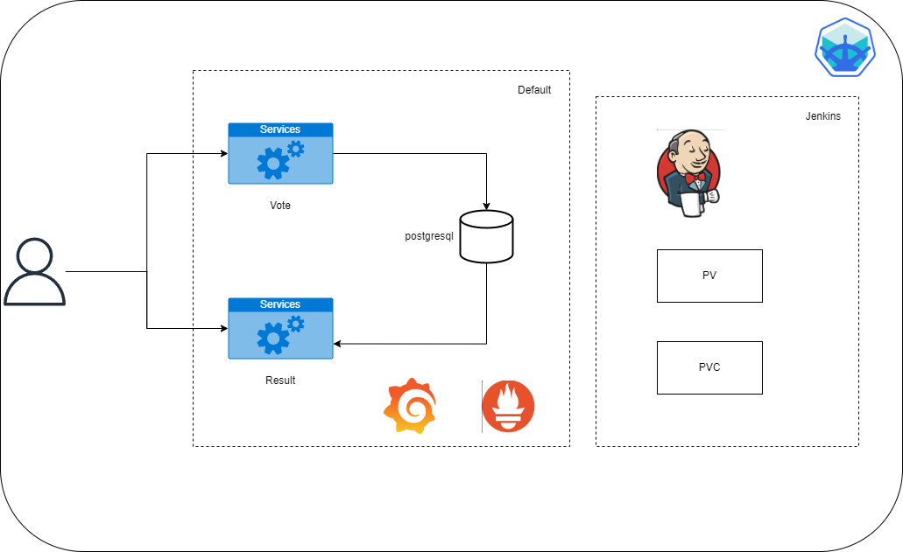

# <b> **_Aplicación de Votación_** </b>

Esta es una aplicación sin servidor construida con Docker. Lee más en el [repositorio de example-voting-app](https://github.com/bfirsh/funker-example-voting-app).

**Nota:** Por requerimientos del presente proyecto se modifico el código fuente.

## <b> _Arquitectura_ </b>

Consiste en un servidor de entrada simple que escucha las solicitudes HTTP. Toda la otra funcionalidad de la aplicación se ejecuta bajo demanda como contenedores de Docker para cada solicitud HTTP:

- **_vote_**: La aplicación web de votación, como un contenedor CGI que sirve una única solicitud HTTP.
- **_result_**: La aplicación web de resultados, como un contenedor CGI.

### ¿Que es Serverless?

La arquitectura serverless (sin servidor) es un modelo de computación en la nube donde los desarrolladores pueden ejecutar código sin tener que gestionar la infraestructura subyacente. En lugar de preocuparse por servidores físicos o virtuales, los desarrolladores simplemente suben su código a un proveedor de servicios en la nube (como AWS Lambda, Azure Functions o Google Cloud Functions) y el proveedor se encarga de todo lo demás.

## <b> _Arquitectura del despliegue_ </b>



## <b> _Tecnologías usadas en el desarrollo del proyecto_ </b> 🛠️

* Docker
* Docker compose
* Kubernetes
* Helm
* Jenkins
* Github Webhook
* Ngrook
* Prometheus
* Grafana

## <b> _Estrategia de Branching_ </b> 📄

* ### Github Flow: 
Se basa en un flujo de trabajo basado en branches que permite a equipos de desarrollo enfocarse principalmente en la entrega continua. A diferencia de Git Flow, no existen los branches de “releases”, ya que está pensado para que la implementación en producción ocurra con frecuencia, incluso varias veces al día si es posible. 

En esta estrategia de branching, en el repositorio tenemos dos tipos de branches: 

- main (o master): el branch de código principal, es el que contiene el código que está listo para producción. 

- features: los branches de funcionalidades que permiten el desarrollo en paralelo. 

Principios que seguir: 

- El código que está en main debe poder implementarse en producción en cualquier momento. 

- Cuando se crean nuevos feature branches, se deben crear con nombres descriptivos. Por ejemplo, feature/add-new-account-type. 

## <b> _Ejecución_ </b>

Ejecuta en el directorio raiz del proyecto:

### Despliegue de la Aplicación


#### Para ejecutar los microservicios con docker

- Es necesario tener ````docker y docker compose```` instalado en el sistema
- Dentro de la carpeta principal, ejecutar el comando ````docker-compose up -d```` para levantar todos los servicios al mismo tiempo 

#### Para ejecutar los microservicios con kubernetes

Se deben ejecutar los siguientes comandos para levantar los servicios en el cluster haciendo uso de helm:

```bash
helm install vote ./charts/vote
helm install result ./charts/result
helm install database ./charts/database
```
Para instalar jenkins en el cluster se hace uso de los siguientes comandos:

```bash 
kubectl apply -f ./jenkins/jenkins-ns.yaml
kubectl apply -f ./jenkins/jenkins-pv.yaml
kubectl apply -f ./jenkins/jenkins-pvc.yaml
helm repo add jenkins https://charts.jenkins.io
helm repo update
helm install jenkins --namespace jenkins --values values.yaml jenkins/jenkins 
```
Para obtener la contraseña por defecto del usuario `admin` de jenkins ejecuta:

```bash
  kubectl exec --namespace jenkins -it svc/jenkins -c jenkins -- /bin/cat /run/secrets/additional/chart-admin-password && echo
```

Se debe otorgar acceso a la cuenta por defecto que crea jenkins para poder hacer uso del pipeline de la app. Este comando crea un `ClusterRoleBinding` que otorga permisos de administrador de clúster a los usuarios `admin` y `kubelet`, así como al grupo `system:serviceaccounts`:

```bash
kubectl create clusterrolebinding permissive-binding --clusterrole=cluster-admin --user=admin --user=kubelet --group=system:serviceaccounts
```


Para desplegar prometheus y grafana para monitorear los pods del cluster se debe ejecutar:

```bash
chmod +x ./monitoring/deploy_prometheus_grafana.sh
./monitoring/deploy_prometheus_grafana.sh 
```


## <b> _Por:_ </b>
<b> 😊😊 _**Ing. DevOps:**_ 😊😊 </b>

+ [Camilo González Velasco](https://github.com/camilogonzalez7424 "Camilo G.")
+ [Jhorman Mera](https://github.com/JhormanMera "Jhorman M.")

<br>

[](https://forthebadge.com)
[](https://forthebadge.com)

<!--[](https://forthebadge.com)-->
